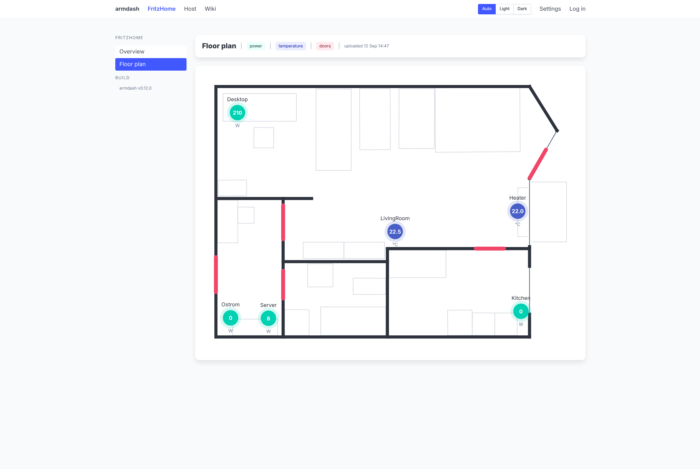

# dragon-dash


A single-binary web dashboard for a home server. One tab per *system*: server
metrics, FRITZ!Box smart home, and whatever comes next. Everything is read from
Prometheus, so every number on screen has history behind it.

Built for a small always-on ARM home server running Arch Linux ARM, but
nothing in it is specific to any particular board.



> **Status: early.** The shell, the settings system and two systems exist and
> run, and there are packages to install them with. Expect the interfaces to
> still move before 1.0.

## Why it exists

Grafana is the obvious answer and it is a good one, but it is a large dependency
to run permanently on a 12 W box, it is **not packaged for aarch64** at all
(neither in Arch Linux ARM's repos nor the AUR), and most of it goes unused when
all you want is a handful of charts and a floor plan of your flat.

dragon-dash is the small version of that: one static binary, no database, no
node toolchain, no runtime dependencies. Go with the standard library only,
server-rendered `html/template` with [htmx](https://htmx.org),
[Bulma](https://bulma.io) for the CSS and [uPlot](https://github.com/leeoniya/uPlot)
for the charts, all three committed as files and embedded with `go:embed`.
There is no `package.json` and never will be.

## What it shows

### Host

Server metrics from `prometheus-node-exporter`: CPU, memory, filesystem usage,
temperatures, load and uptime. An overview of current values, plus a chart per
metric with ranges from one hour to one year. The thermals chart names its
lines, so a warm board says which part is warm.

### FritzHome

FRITZ!Box smart home data: smart plug power and energy, room temperatures,
humidity, thermostat setpoints and battery levels.

dragon-dash talks to the box itself over AVM's documented interfaces, so there
is no separate exporter to run and the credentials live in one place. The page
shows the live reading; the same reading is published at `/metrics` for
Prometheus to keep as history.

The floor plan above shows every device at its spot with its live reading. The
flat is a SweetHome3D drawing or any SVG or picture of it, uploaded on the
page, or a hand-traced JSON file, and devices are placed by dragging them in
edit mode, so redrawing the flat never means recompiling.

## Installing

Grab a package or a tarball from [releases](https://github.com/xuedi/dragon-dash/releases).
Every release carries static amd64 and arm64 binaries plus `.deb`, `.rpm` and
Arch packages, all built from the same commit.

```bash
sudo pacman -U dragon-dash-*-aarch64.pkg.tar.zst   # or dpkg -i / rpm -i
sudoedit /etc/dragon-dash/dragon-dash.env          # address, Prometheus, FRITZ!Box
sudo systemctl enable --now dragon-dash
```

The package installs a hardened systemd unit that runs as a dedicated
unprivileged user with the filesystem read-only except for one directory,
`/var/lib/dragon-dash`, which holds an uploaded floor plan and the device
positions. Configuration is read-only and the history lives in Prometheus.
`CAP_NET_BIND_SERVICE` is granted so ports 80 and 443 work without root.

dragon-dash keeps no history itself, so a full deployment is three services:
node_exporter and dragon-dash's own `/metrics` are scraped by Prometheus, and
dragon-dash queries Prometheus back to draw the pages. Both exporters are
packaged for aarch64, so none of it needs containers. `deploy/` also holds a
Compose stack for hosts where containers are preferred. Details in
[`docs/deployment.md`](docs/deployment.md).

## Configuring it

Env files and the environment, nothing else: `.env.dist` for committed defaults,
`.env.local` for credentials, real environment variables winning over both. The
packaged unit reads `/etc/dragon-dash/dragon-dash.env` instead.

```ini
DD_CORE_ADDR=127.0.0.1:9494
DD_CORE_PROMETHEUS_URL=http://127.0.0.1:9090
DD_SYSTEM_FRITZHOME_URL=http://fritz.box
```

Configuration is **read-only at runtime**, which is the point. The Settings page
shows what is set and where each value came from, but nothing writes it back.
With no write path there is no form to protect, and that is what makes a LAN
tool without authentication defensible. Full key list in
[`docs/configuration.md`](docs/configuration.md).

Setting `DD_CORE_TLS_CERT` and `DD_CORE_TLS_KEY` turns on HTTPS on
`DD_CORE_TLS_ADDR`. The plain port then redirects there, except `/metrics`,
which Prometheus keeps scraping over HTTP. Details in
[`docs/deployment.md`](docs/deployment.md#https).

`DD_LINKS` adds navbar entries for other sites, a wiki or a Grafana, shown below
the navbar in an iframe, optionally through a built-in reverse proxy so they
share the dashboard's origin. Details in [`docs/links.md`](docs/links.md).

## Building and running from source

```bash
just run          # http://127.0.0.1:9494
just run-lan      # reachable from other machines
just build-arm    # static arm64 binary, no cgo, target needs no toolchain
just check        # gofmt, vet, tests
```

Until `DD_CORE_PROMETHEUS_URL` points somewhere real, every page politely says
so rather than showing zeroes. For real data while developing, run Prometheus
and node_exporter on the desktop with `just dev-up` (prometheus on `:9090`,
node_exporter on `:9100`).

## Security

**There is no authentication.** Anyone who can reach the port can read Settings.
That is a deliberate choice for a LAN tool, but it means dragon-dash must not be
port-forwarded or exposed to the internet.

## Licence

[EUPL-1.2](LICENSE).

## Contributing

Run `just check` first: gofmt, vet, tests. How the thing is put together, the
system interface, the config layers, the Prometheus client and the frontend, is
written up in [`docs/`](docs/README.md).
