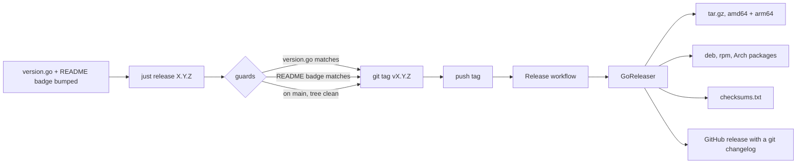
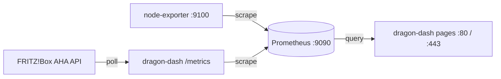

# Releases and deployment

How a commit becomes a numbered release, and how that release ends up serving a dashboard on a
home server.

## Versioning

`internal/version/version.go` holds the single source of truth. Nothing is stamped in at link
time, so a binary built from a tarball, from CI or from a `go build` on a laptop all report the
same number. Two other places mirror it and must move in the same commit:

- the version badge in `README.md`
- the git tag, which is `v` plus the constant

Semantic versioning, pre-1.0: patch for a fix or a small change, minor for a notable feature, and
1.0 is a deliberate milestone rather than something that arrives by accretion.

The running binary reports it in two ways, which is what makes a deployed build identifiable
without checksums:

```
dragon-dash -version
```

and the navbar sidebar, under the Build label.

## Cutting a release



`just release VERSION` refuses to tag when the constant, the badge, the branch or a dirty tree
disagree with what is being released. It only tags and pushes; everything after that happens in
CI, so a release cannot depend on what happens to be installed on one machine.

`just release-snapshot` runs the whole pipeline locally into `./dist` without publishing, which is
the way to check a packaging change before tagging. It needs `goreleaser` on `PATH`.

## What a release contains

| Artifact | For |
|---|---|
| `dragon-dash_<version>_linux_arm64.tar.gz` | the binary, README, licence, `.env.dist`, the unit file |
| `dragon-dash_<version>_linux_amd64.tar.gz` | same, for an x86 host |
| `dragon-dash-<version>-*.pkg.tar.zst` | Arch and Arch ARM |
| `dragon-dash_<version>_*.deb` / `.rpm` | Debian, Ubuntu, Fedora |
| `checksums.txt` | verifying any of the above |

The binary is static and pure Go, so the target needs no toolchain, no runtime and no shared
library beyond what a bare system already has.

## What the packages install

```
/usr/bin/dragon-dash                          the binary
/usr/lib/systemd/system/dragon-dash.service   the unit, shipped disabled
/usr/share/dragon-dash/dragon-dash.env.example the seed configuration
/etc/dragon-dash/dragon-dash.env              0640 root:dragon-dash, seeded on first install
/var/lib/dragon-dash/                         0700 dragon-dash, created by systemd on start
```

The post-install creates the `dragon-dash` system user, seeds the configuration only when there is
not one already (an upgrade must never drop credentials) and leaves the unit disabled, because a
dashboard with no FRITZ!Box credentials and no Prometheus address is not worth starting.

The unit is hardened further than most, and can be, because **the app writes almost nothing**.
Configuration is read-only by design and every metric lives in Prometheus. The one writable path is
`/var/lib/dragon-dash`, from `StateDirectory=`, where an uploaded floor plan and device positions
are kept (see [floorplan.md](floorplan.md)). `ProtectSystem=strict` keeps everything else read-only.
The one capability granted is `CAP_NET_BIND_SERVICE`, which is what lets an unprivileged process
answer on ports 80 and 443.

`StateDirectory=` arrived in 0.10.0. A package upgrade brings the new unit; swapping only the binary
does not, and until the unit is updated (and `systemctl daemon-reload` run) the floor plan page
simply offers no upload and no edit mode.

## Configuration on a server

Everything is in `/etc/dragon-dash/dragon-dash.env`, in the same `DD_` variables the development
`.env.local` uses. `DD_CORE_ADDR` decides the port, so moving the dashboard to another port is an
edit and a restart, not a rebuild. See [configuration.md](configuration.md).

The committed defaults stay on high loopback ports, `127.0.0.1:9494` and `127.0.0.1:9495` for
HTTPS, so a development checkout never collides with anything else on the machine. Ports 80 and
443 only ever appear in the server's env file.

## HTTPS

dragon-dash terminates TLS itself, there is no proxy to run. Set both paths and it serves the
dashboard on `DD_CORE_TLS_ADDR` as well:

```ini
DD_CORE_ADDR=:80
DD_CORE_TLS_ADDR=:443
DD_CORE_TLS_CERT=/etc/dragon-dash/tls/dragon-dash.crt
DD_CORE_TLS_KEY=/etc/dragon-dash/tls/dragon-dash.key
```

With TLS on, the plain listener keeps running but redirects every request to HTTPS, **except
`/metrics`**. Prometheus scrapes that over plain loopback HTTP as before, so its configuration does
not change and it never has to trust the certificate. Setting only one of the two paths refuses to
start rather than quietly staying on HTTP.

The certificate comes from whatever CA the browsers on the network already trust, for a LAN host
name typically a private one. Every device that opens the dashboard needs that CA imported, which
is also why there is **no `Strict-Transport-Security` header**: a long-lived pin on a LAN host name
would lock out any device without the CA, and every other plain-HTTP service on the same name.

The service user reads the pair, nobody else reads the key:

```
/etc/dragon-dash/tls/                 0750 root:dragon-dash
/etc/dragon-dash/tls/dragon-dash.crt  0644 root:dragon-dash
/etc/dragon-dash/tls/dragon-dash.key  0640 root:dragon-dash
```

The pair is read once at startup, like the rest of the configuration, so a renewed certificate
takes effect on the next restart. The unit needs no change: `ProtectSystem=strict` still allows
reading `/etc`, and `CAP_NET_BIND_SERVICE` covers port 443 as it does port 80. The Settings page
shows which certificate and key are in use.

## The other half: Prometheus

dragon-dash reads everything from Prometheus and stores nothing itself, so a deployment is really
three services:



dragon-dash appears twice on purpose. It polls the FRITZ!Box and republishes what it finds on
`/metrics` for Prometheus to scrape, and it queries Prometheus to draw the pages. That is why the
FRITZ!Box credentials exist in exactly one place and there is no separate exporter to keep alive.

Prometheus and node_exporter are both packaged for aarch64 (`extra/prometheus`,
`extra/prometheus-node-exporter`), so a native install needs no containers. `deploy/` also holds a
compose file for hosts where containers are preferred.

Two Prometheus flags matter:

- `--storage.tsdb.retention.time=10y`, because the default is 15 days and indefinite history is the
  entire point of the project.
- `--web.enable-admin-api`, if the snapshot backup path is wanted. It also means Prometheus should
  listen on loopback only.

### Storage

Measured on a deployed instance, not estimated: node_exporter, dragon-dash and Prometheus itself
come to **1663 active series** together on a small board, of which node_exporter is 834 and the
FRITZ!Box data 45. At a 60 s scrape that is ~28 samples/s, and Prometheus compresses to roughly
1.7 bytes/sample:

```
28 samples/s x 1.7 bytes  ~=  4 MB/day  ~=  1.5 GB/year
```

A decade fits in under 20 GB. Any modern root filesystem holds that, so the TSDB does not need a
dedicated data disk, and putting it on one is a preference rather than a requirement. A bigger host
reports more series (a desktop's node_exporter alone reports about 1100), but the order of magnitude
does not change.
