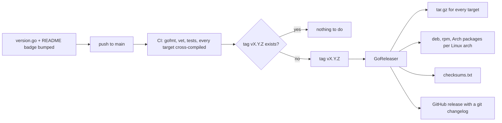
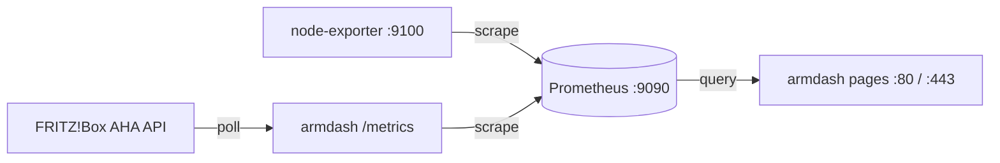

# Releases and deployment

How a commit becomes a numbered release, and how that release ends up serving a dashboard on a
home server. The step-by-step install is [install.md](install.md).

## Versioning

`internal/version/version.go` holds the single source of truth. Nothing is stamped in at link
time, so a binary built from a tarball, from CI or from a `go build` on a laptop all report the
same number. Two other places mirror it and must move in the same commit:

- the version badge in `README.md`
- the git tag, `v` plus the constant, which CI makes (see below)

Semantic versioning, pre-1.0: patch for a fix or a small change, minor for a notable feature, and
1.0 is a deliberate milestone rather than something that arrives by accretion.

The running binary reports it in two ways, which is what makes a deployed build identifiable
without checksums:

```
armdash -version
```

and the navbar sidebar, under the Build label.

## Releases



Every version that reaches `main` is released. CI's release job runs only on pushes to `main` and
only once the tests pass. It reads the version from `version.go`, refuses when the README badge
disagrees, and when that version has no tag yet it tags the commit and runs GoReleaser in the same
job. A tag pushed with the workflow's own token starts no other workflow, which is why tagging and
publishing cannot be split into two. A push that leaves the version alone releases nothing.

Bumping the version is therefore the release decision, and before 1.0 every change that ships gets
its own small release. Tags are never made by hand. If the job tags and then fails, the manual
Release workflow publishes the existing tag again.

`just release-snapshot` runs the whole pipeline locally into `./dist` without publishing, which is
the way to check a packaging change before tagging. It needs `goreleaser` on `PATH`.

## What a release contains

| Artifact | For |
|---|---|
| `armdash_<version>_<os>_<arch>.tar.gz` | the binary, README, licence, `.env.dist`, the unit file, the example Prometheus config |
| `armdash_<version>_linux_<arch>.pkg.tar.zst` | Arch and Arch ARM |
| `armdash_<version>_linux_<arch>.deb` / `.rpm` | Debian, Ubuntu, Raspberry Pi OS, Fedora |
| `checksums.txt` | verifying any of the above |

| Platform | Architectures | Packages |
|---|---|---|
| Linux | `amd64`, `arm64`, `armv7`, `riscv64` | deb and rpm for all four, Arch for all but riscv64 |
| FreeBSD | `amd64`, `arm64` | tarball only |
| macOS | `amd64`, `arm64` | tarball only |

`armv7` is 32-bit ARM, such as Raspberry Pi OS 32-bit, and packages as `armhf`. The binary is
static and pure Go, so a target needs no toolchain, no runtime and no shared library beyond what a
bare system already has. The packages and the unit are systemd's; on FreeBSD and macOS the binary
runs the same, under whatever supervises services there.

## What the packages install

```
/usr/bin/armdash                            the binary
/usr/lib/systemd/system/armdash.service     the unit, shipped disabled
/usr/share/armdash/armdash.env.example      the seed configuration
/usr/share/armdash/prometheus.yml.example   scrape jobs for a Prometheus on the same host
/etc/armdash/armdash.env                    0640 root:armdash, seeded on first install
/var/lib/armdash/                           0700 armdash, created by systemd on start
```

The packages bring Prometheus and node_exporter along. On Debian and Fedora they are
*recommends*, which apt and dnf install by default and which someone with Prometheus on another
host can decline. The Arch format has no weak dependency, so there they are hard dependencies.

The post-install creates the `armdash` system user, seeds the configuration only when there is
not one already (an upgrade must never drop credentials) and leaves the unit disabled, because a
dashboard with no FRITZ!Box credentials and no Prometheus address is not worth starting. It then
prints the steps still missing, among them `armdash passwd`, which prints the owner login for the
env file, see [authentication.md](authentication.md). Without it the dashboard runs, but nothing
can be changed.

To know which Prometheus steps are missing, the post-install reads the local setup: whether a
scrape job covers armdash's port and node_exporter, whether a retention is set, whether the
services are enabled. It changes none of it. That configuration belongs to the Prometheus package,
an edit there would turn into a conflict on its next upgrade, and ten years of retention is a
decision about disk space.

An upgrade restarts a running armdash on the new binary and leaves a stopped one stopped.

`just install` does the same from a checkout on the machine itself: it builds, installs the binary
to `/usr/local/bin`, creates the user, seeds the env file when there is none and installs the unit
with its `ExecStart` pointed there, disabled. It needs sudo, and it installs no Prometheus.

The unit is hardened further than most, and can be, because **the app writes almost nothing**.
Configuration is read-only by design and every metric lives in Prometheus. The one writable path is
`/var/lib/armdash`, from `StateDirectory=`, where an uploaded floor plan and device positions
are kept (see [floorplan.md](floorplan.md)). `ProtectSystem=strict` keeps everything else read-only.
The one capability granted is `CAP_NET_BIND_SERVICE`, which is what lets an unprivileged process
answer on ports 80 and 443.

`StateDirectory=` arrived in 0.10.0. A package upgrade brings the new unit; swapping only the binary
does not, and until the unit is updated (and `systemctl daemon-reload` run) the floor plan page
simply offers no upload and no edit mode.

The login arrived in 0.11.0. An upgrade from an earlier version keeps every page, but loses Upload
and Edit until `AD_CORE_AUTH_USER` and `AD_CORE_AUTH_PASSWORD_HASH` are in the env file.

## Configuration on a server

Everything is in `/etc/armdash/armdash.env`, in the same `AD_` variables the development
`.env.local` uses. `AD_CORE_ADDR` decides the port, so moving the dashboard to another port is an
edit and a restart, not a rebuild. See [configuration.md](configuration.md).

The committed defaults stay on high loopback ports, `127.0.0.1:9494` and `127.0.0.1:9495` for
HTTPS, so a development checkout never collides with anything else on the machine. Ports 80 and
443 only ever appear in the server's env file.

## HTTPS

armdash terminates TLS itself, there is no proxy to run. Set both paths and it serves the
dashboard on `AD_CORE_TLS_ADDR` as well:

```ini
AD_CORE_ADDR=:80
AD_CORE_TLS_ADDR=:443
AD_CORE_TLS_CERT=/etc/armdash/tls/armdash.crt
AD_CORE_TLS_KEY=/etc/armdash/tls/armdash.key
```

With TLS on, the plain listener keeps running but redirects every request to HTTPS, **except
`/metrics`**. Prometheus scrapes that over plain loopback HTTP as before, so its configuration does
not change and it never has to trust the certificate. Setting only one of the two paths refuses to
start rather than quietly staying on HTTP.

The certificate comes from whatever CA the browsers on the network already trust, for a LAN host
name typically a private one. Every device that opens the dashboard needs that CA imported, which
is also why there is **no `Strict-Transport-Security` header**: a long-lived pin on a LAN host name
would lock out any device without the CA, and every other plain-HTTP service on the same name.

The service user reads the pair, nobody else reads the key:

```
/etc/armdash/tls/              0750 root:armdash
/etc/armdash/tls/armdash.crt   0644 root:armdash
/etc/armdash/tls/armdash.key   0640 root:armdash
```

The pair is read once at startup, like the rest of the configuration, so a renewed certificate
takes effect on the next restart. The unit needs no change: `ProtectSystem=strict` still allows
reading `/etc`, and `CAP_NET_BIND_SERVICE` covers port 443 as it does port 80. The Settings page
shows which certificate and key are in use.

## The other half: Prometheus

armdash reads everything from Prometheus and stores nothing itself, so a deployment is really
three services:



armdash appears twice on purpose. It polls the FRITZ!Box and republishes what it finds on
`/metrics` for Prometheus to scrape, and it queries Prometheus to draw the pages. That is why the
FRITZ!Box credentials exist in exactly one place and there is no separate exporter to keep alive.

The packages pull Prometheus and node_exporter in, so a native install needs no containers.
[install.md](install.md) goes through the Prometheus side per distribution: the two scrape jobs,
the retention and where each distribution keeps them. `deploy/` also holds a compose file for hosts
where containers are preferred.

Two Prometheus flags matter:

- `--storage.tsdb.retention.time=10y`, because the default is 15 days and indefinite history is the
  entire point of the project.
- `--web.enable-admin-api`, if the snapshot backup path is wanted. It also means Prometheus should
  listen on loopback only.

### Storage

Measured on a deployed instance, not estimated: node_exporter, armdash and Prometheus itself
come to **1663 active series** together on a small board, of which node_exporter is 834 and the
FRITZ!Box data 45. At a 60 s scrape that is ~28 samples/s, and Prometheus compresses to roughly
1.7 bytes/sample:

```
28 samples/s x 1.7 bytes  ~=  4 MB/day  ~=  1.5 GB/year
```

A decade fits in under 20 GB. Any modern root filesystem holds that, so the TSDB does not need a
dedicated data disk, and putting it on one is a preference rather than a requirement. A bigger host
reports more series (a desktop's node_exporter alone reports about 1100), but the order of magnitude
does not change.
